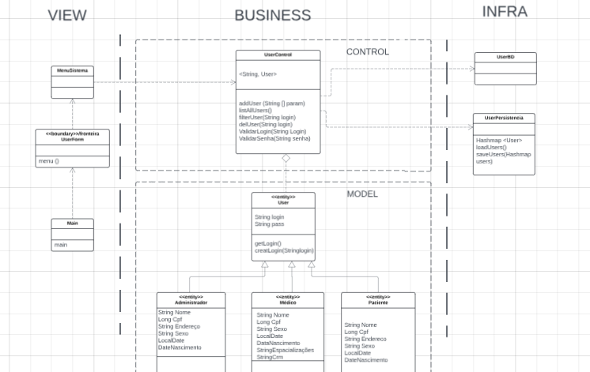

# Projeto Médico de Cadastro de Consultas

## Descrição

Este projeto é um sistema para o cadastro e gerenciamento de consultas médicas. O objetivo é fornecer uma solução completa para o registro de pacientes, médicos, administradores e consultas, facilitando o agendamento e o acompanhamento dos atendimentos.

## Funcionalidades

- **Cadastro de Pacientes**: Permite o cadastro e a validação dos dados dos pacientes.
- **Cadastro de Médicos**: Permite o cadastro e a validação dos dados dos médicos.
- **Cadastro de Administradores**: Permite o cadastro e a validação dos dados dos administradores do sistema.
- **Agendamento de Consultas**: Permite o agendamento de consultas entre pacientes e médicos.
- **Validações**: Inclui validações para login e senha, conforme as políticas de segurança.

## Modelos

### Usuario

- **Atributos**: Nome, CPF, endereço, sexo, data de nascimento.

### Administrador

- **Herança**: Extende `Usuario`.
- **Atributos**: Adiciona atributos específicos para administradores (não especificados no exemplo).

### Medico

- **Herança**: Extende `Usuario`.
- **Atributos**: Especializações, CRM.

### Paciente

- **Herança**: Extende `Usuario`.
- **Atributos**: Pode incluir atributos específicos dos pacientes.

### Consulta

- **Atributos**: Data e hora da consulta, médico responsável, paciente, detalhes adicionais.

## Diagrama de Classe

Abaixo está o diagrama de classe do sistema, que ilustra a estrutura das principais classes e suas interações:



## Estrutura do Projeto

### Model

- **Usuarios**: Representa um usuário genérico com atributos comuns como nome, CPF, endereço, sexo e data de nascimento.
- **Administrador**: Herda de `Usuarios` e pode ter atributos e métodos específicos para a administração do sistema.
- **Medicos**: Herda de `Usuarios` e adiciona atributos específicos como especializações e CRM.
- **Pacientes**: Herda de `Usuarios` e pode incluir outros atributos específicos dos pacientes.
- **Consultas**: Representa uma consulta médica com atributos como data, hora, médico responsável, paciente e detalhes adicionais.

### Service

- **AdminsService**: Gerencia as operações relacionadas aos administradores, incluindo cadastro e validação de dados.
- **PacientesService**: Gerencia as operações relacionadas aos pacientes, incluindo cadastro e validação de dados.
- **MedicosService**: Gerencia as operações relacionadas aos médicos, incluindo cadastro e validação de dados.
- **ConsultasService**: Gerencia as operações relacionadas às consultas, incluindo o agendamento e a listagem de consultas.

### Controller

- **AdminsController**: Controla a interação entre o usuário e o sistema, gerenciando o cadastro e a listagem de administradores.
- **PacientesController**: Controla a interação entre o usuário e o sistema, gerenciando o cadastro e a listagem de pacientes.
- **MedicosController**: Controla a interação entre o usuário e o sistema, gerenciando o cadastro e a listagem de médicos.
- **ConsultasController**: Controla a interação entre o usuário e o sistema, gerenciando o agendamento e a listagem de consultas.

## Configuração e Execução

1. **Clone o Repositório**

   ```bash
   git clone https://github.com/seu_usuario/seu_repositorio.git
   ```

2. **Navegue até o Diretório do Projeto**

   ```bash
   cd src/SisMed
   ```

3. **Compile o Projeto**

   ```bash
   mvn clean install
   ```

4. **Execute o Projeto**

   ```bash
   mvn exec:java -Dexec.mainClass="SisMed.Main"
   ```

## Contribuição

Contribuições são produziadas pela equipe do projeto da disciplina de Métodos de Projeto de Software por todo o semestre.

## Licença

Este projeto está licenciado sob a [Licença MIT](LICENSE).
